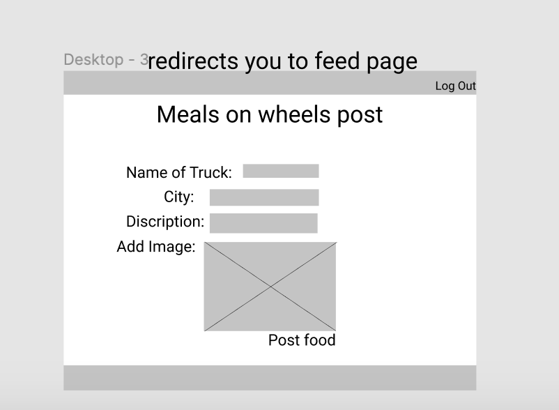
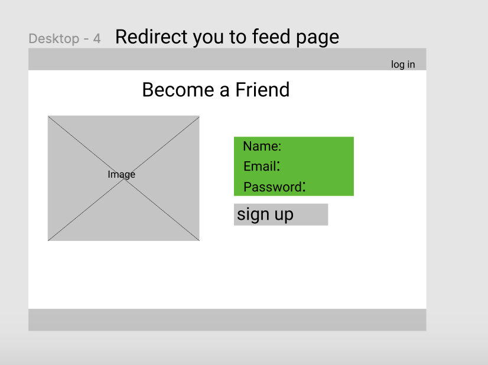
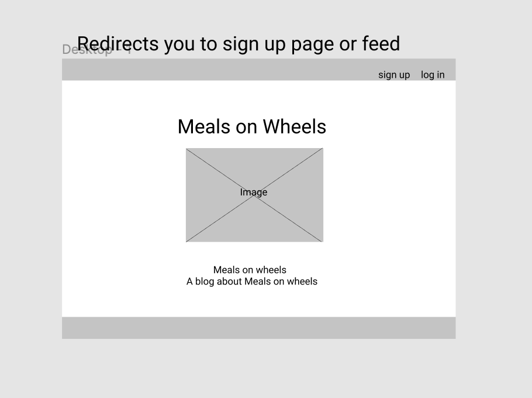
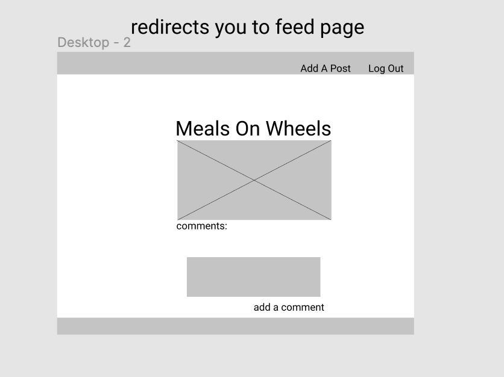
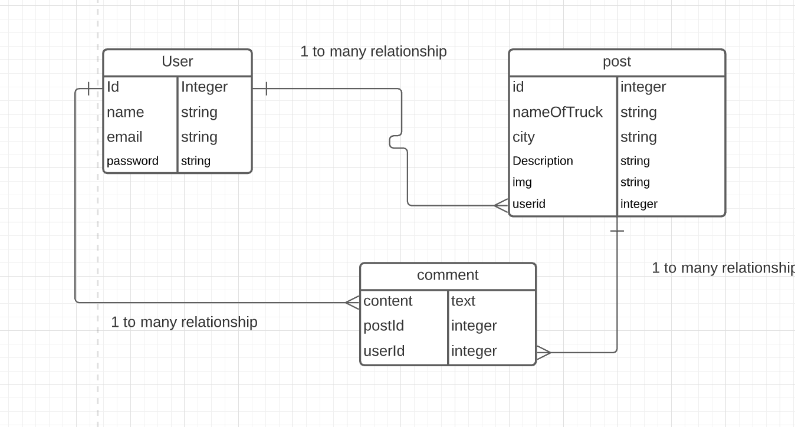

Overview
To get your project idea approved for the Unit 1 project, you will begin developing your project's README file. The approval process will follow the steps below:

Learn about README files and markdown
Fork and clone this README for your project
In your copy, fill out the following fields:
Title & Blurb
Motivation
User Stories & Wireframes
Submit a pull request for project approval
Get your project approved
Copy this template to your project repository
Complete your README as your project develops
What is a README?
A README is a file that describes a project, program or app. It often includes information on technologies used, how to install or use the app, and code examples.

On GitHub, a README in your repo acts like an index.html file. If there is a README in a directory of a repo, the README will display as an HTML page.

Markdown
Markdown is a plain text format for writing structured documents. It uses non-alphabetic characters to indicate simple styling choices. The simple syntax makes it easy to read in its raw format and converts easily to a formatted HTML document.

GFM (GitHub Flavored Markdown)
GitHub Flavored Markdown, aka GFM, is a dialect of Markdown. It uses the same syntax as Markdown with some additional features, e.g., direct embedding of HTML.

Basic Syntax
h1 - h6 head tags
# = h1, ## = h2, etc.

**text** = bold
*text* = italic

[link text](absolute or relative url)

Markdown Resources
GFM basic syntax
Mastering Markdown on GitHub
GitHub Flavored Markdown Spec
Project READMEs at GA logo
Example:

Project Title
A blurb about your project; what is it?

Motivation
A short description about why you built this app.

Screenshots
screen captures of your app

User Stories & Wireframes
The planning materials used to build this app.

High-level user stories.
image files of wireframes
wireframe 1

wireframe 2

Technologies & Code Snippets
list of technologies
screen captures of your code
Credits
Give credit to any codepen that inspired you, medium article that helped you, or stackoverflow that pointed you in the right direction.

Future development
What are the next steps for the project? How will you continue to evolve it?